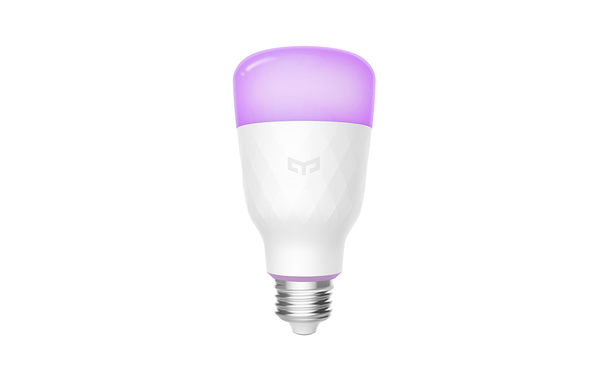
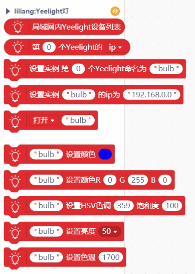
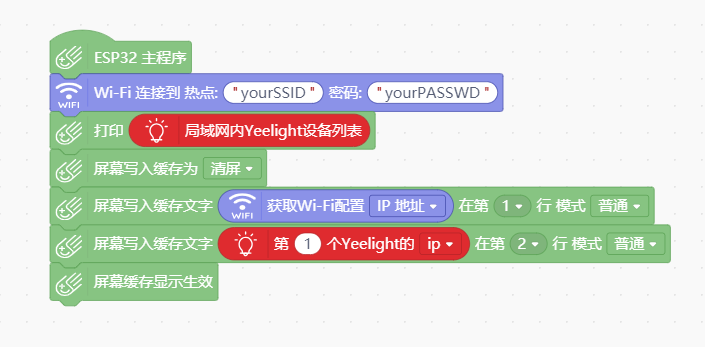
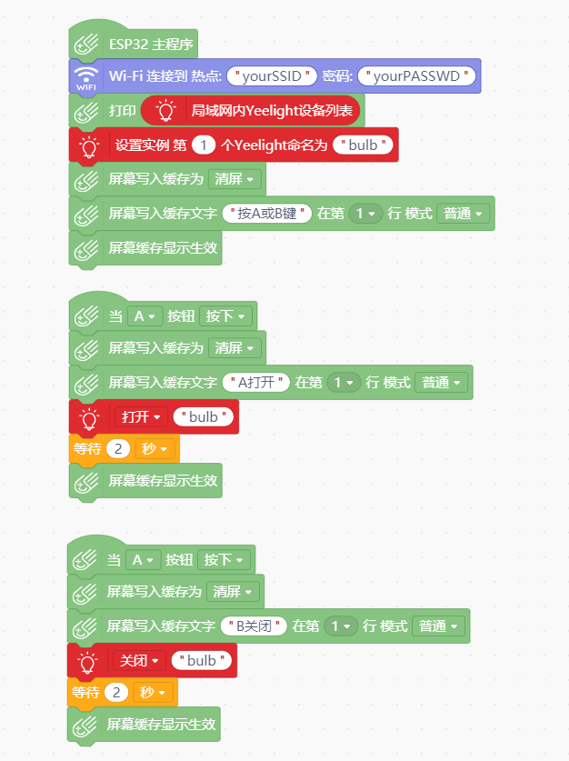

# Yeelight
Yeelight智能物联网LED灯泡
Yeelight intelligent IOT LED bulb

# 说明
此扩展库适用于Mind+中掌控板的MicroPython模式，可以通过wifi控制Yeelight灯

# 积木

# 程序实例

# 支持列表

|主板型号|实时模式|ArduinoC|MicroPython|备注|
|-----|-----|:-----:|:-----:|-----|
|mpython|||√||

# 更新日志

V0.0.1 基础功能完成 未经过实物测试

