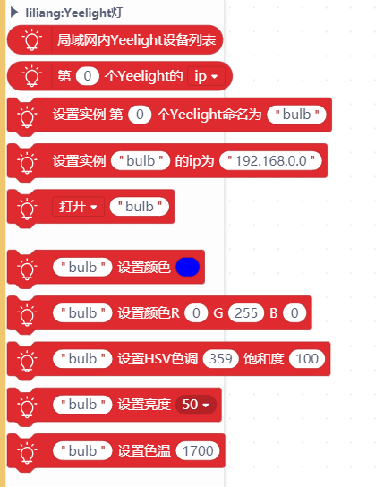
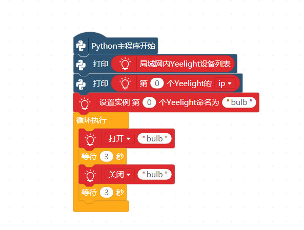
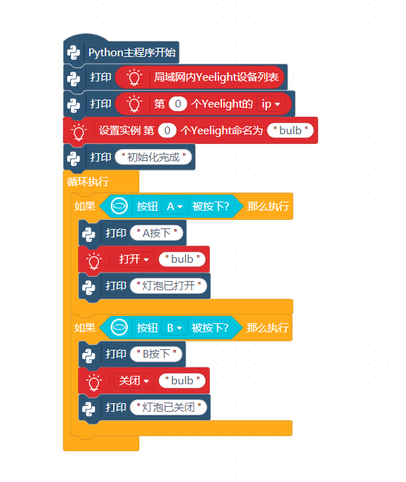
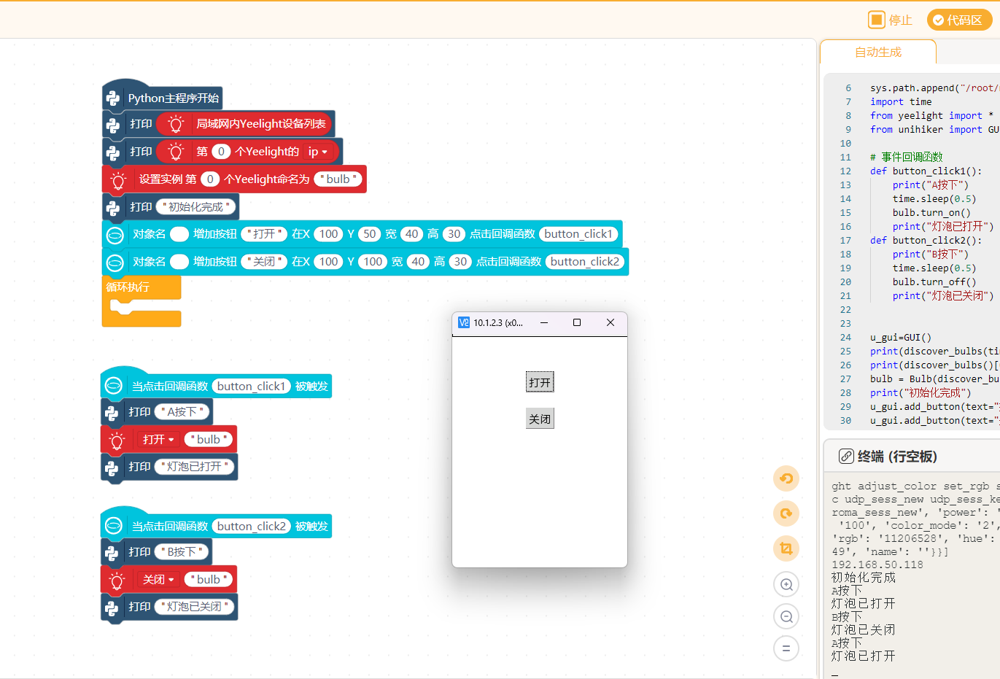

# Yeelight
Yeelight智能物联网LED灯泡
Yeelight intelligent IOT LED bulb

# 说明
此扩展库适用于Mind+中Python模式、行空板以及掌控板的MicroPython模式，可以通过同一局域网wifi控制Yeelight灯

# 使用方法
- 1、以Yeelight灯泡1S彩光版为例，手机上安装Yeelight官方app。  
- 2、app上添加灯泡，按照app中的提示重置灯泡后连接灯泡并打开局域网控制功能，直到app能正常控制。  
- 3、使用主控板编程控制，注意控制指令发送频率不可太高，否则会被灯泡拒绝连接。  

# 程序实例
## Python

> 注：使用行空板时，需要先使用行空板本地网页链接与灯泡相同的WiFi

### 积木

### 示例

## microPython
### 积木

### 示例

# 支持列表

|主板型号|实时模式|ArduinoC|MicroPython|Python|备注|
|-----|-----|-----|-----|-----|-----|
|mpython|||√|||
|行空板||||√||

# 更新日志

V0.0.1 基础功能完成 未经过实物测试

V0.0.2 增加Python模式

